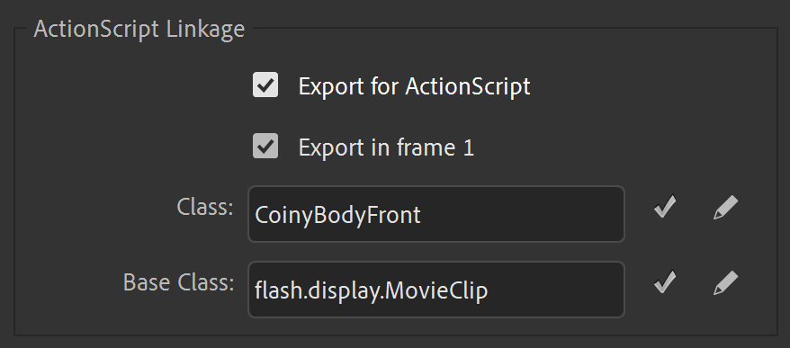

# hello

how to make a good swf:

go to the properties of a movieclip (if it isnt a movieclip then make it one) and then click on advanced

then in the actionscript linkage section click Export for ActionScript

you can call the class whatever you want, it wont have any special characters. whatever you put as the class name will be the symbol name you use when adding an animation

you can also select multiple symbols at once and export for actionscript and they will all get a default name (the symbol name without spaces and special characters) you can still input the unformatted name and the library will automatically format it (also idk if export in frame 1 makes a difference but check that just in case)

